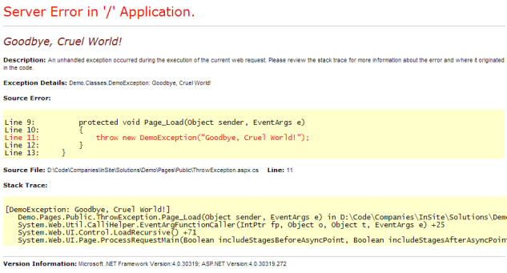
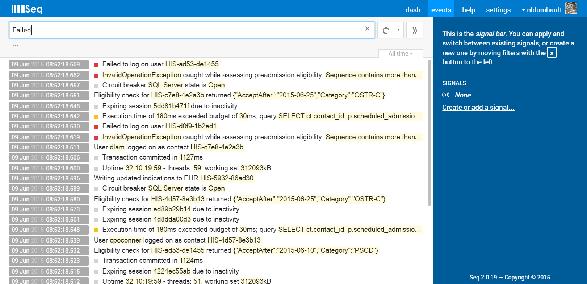

When developing software, exceptions are a fact-of-life you will need to deal with. Don't reinvent the wheel, use an existing exception handling library or service.

The best exception handling service is [Application Insights](/rules-to-better-application-insights), but if you can't use that, try [Seq](https://datalust.co/seq).

Your users should never see the “yellow screen of death” in ASP.NET, or the “unhandled exception” message in a Windows application. Errors should always be caught and logged – preferably in a SQL database. As developers you should be alerted when something is going wrong and be able to see details to help you track down and fix bugs.

::: bad
[Figure: Bad Example - if you see this, you are doing something wrong!]
:::

<!--endintro-->

At SSW we use Application Insights where possible. If you are still developing Windows applications, then you can still use Application Insights, read [here](https://docs.microsoft.com/en-us/azure/azure-monitor/app/windows-desktop) for more details.

::: greybox
**Application Insights** will tell you if your application goes down or runs slowly under load. If there are any uncaught exceptions, you’ll be able to drill into the code to pinpoint the problem. You can also find out what your users are doing with the application so that you can tune it to their needs in each development cycle.
:::

If Application Insights is not available we use Seq when developing web applications. From its [page](https://datalust.co/seq):

::: greybox
**Seq** is built for modern structured logging with message templates. Rather than waste time and effort trying to extract data from plain-text logs with fragile log parsing, the properties associated with each log event are captured and sent to Seq in a clean JSON format. Message templates are supported natively by ASP.NET Core, Serilog, NLog, and many other libraries, so your application can use the best available diagnostic logging for your platform.
:::

Application Insights gives you very useful graphs and analysis which give you a good overview of how things are going. See [here](/rules-to-better-application-insights) for more details. Seq is great for identifying specific issues and how to fix them, but is not as good at letting you see the big picture.

::: good
[Figure: Good Example - Seq provides you with plenty of details about what is happening, but if you don't already know what you're looking for, it can be tricky to parse]
:::

::: good
[Figure: Good Example - Application Insights gives you graphs and analysis that help you find issues, but also lets you drill down to get the details as well]
:::
